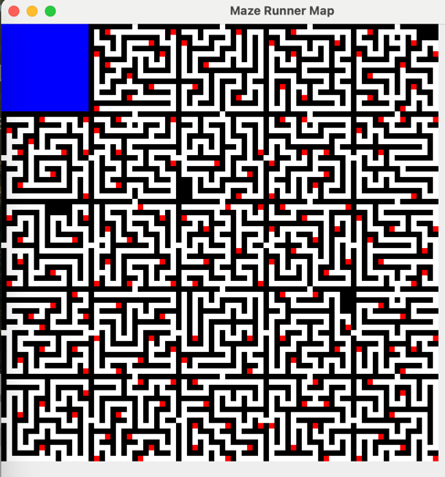
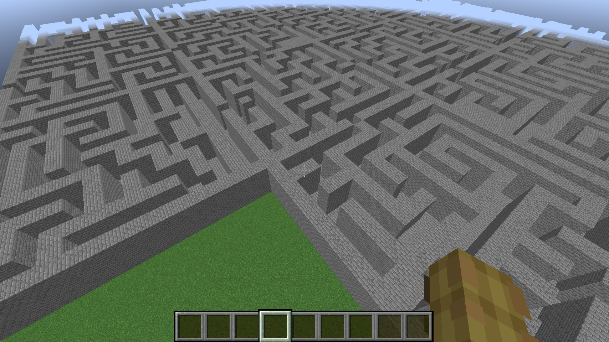

# kMazerunner2

Inspired by https://docs.google.com/document/d/1pZzwFZgHocVSzNsVZvMICYwsCDw4iE61a172TmoE270/edit?tab=t.0

## Features
* replace 1 million blocks in less than a second

## Maze generation
We can paste a maze into a 1.21.4 world in less than a second.

Video demo: https://youtu.be/hvTqjP6Pc-M
